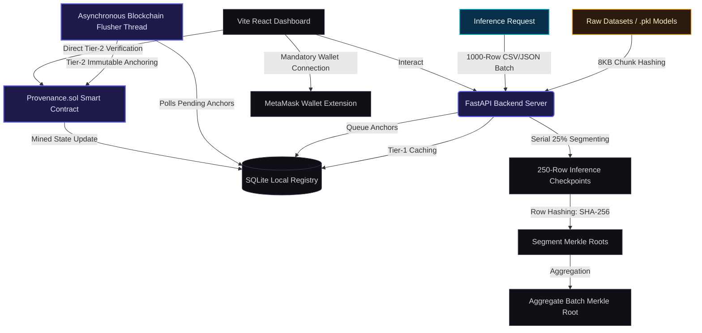

# Provenance.AI — Dual-Track AI/ML Provenance & Audit Registry

<p align="center">
  <a href="#-technology-stack"></a>
  <a href="#-technology-stack"></a>
  <a href="#-technology-stack"></a>
  <a href="#-technology-stack"></a>
  <a href="#-technology-stack"></a>
  <a href="#-technology-stack"></a>
  <a href="#-technology-stack"></a>
</p>

A high-performance, cryptographically secure, dual-track audit node designed to track and verify the integrity of AI/ML assets. **Provenance.AI** registers macro-level datasets and model lineage on-chain, while providing row-level inference auditing at micro-second speed using Merkle trees. 

The architecture is built on a two-tier verification paradigm: high-speed local validation via SQLite and final immutable consensus verification on an Ethereum-compatible blockchain (Hardhat network).

---

## 🌟 Key Features & Core Architecture

The platform separates concerns into two distinct execution tracks to maximize performance and guarantee absolute data integrity:

### 🛡️ 1. Macro Track (Asset & Model Lineage)
- **Scope**: Raw Training/Testing Datasets and compiled AI Model files (e.g., `.pkl` model checkpoints).
- **Integrity Mechanism**: File-level SHA-256 integrity hashing.
- **Relational Constraints**: Enforces deep genealogical relational integrity. Every inference batch maps directly to a model hash, and every model hash maps back to the specific training dataset hash used to create it.
- **Verification Mode (Tier-2 Macro)**: Direct one-to-one byte comparisons of hashes with states anchored inside the blockchain smart contract.
- **RAM Optimization**: Employs an 8KB chunk-streamed hashing algorithm. This avoids loading full files into memory, keeping RAM footprints static regardless of dataset size.

### ⚡ 2. Micro Track (High-Throughput Inference Logging)
- **Scope**: Streamed prediction inputs, predictions, and scores on a row-by-row level.
- **Integrity Mechanism**: Hierarchical Merkle Trees for aggregated batch proofs.
- **Serial Segmentation**: Large inference batches (up to 1,000 rows) are broken down into **four 25% segments (250-row chunks)**. Segments are processed serially, releasing SQLite database locks and caching segments step-by-step to prevent CPU/memory bottlenecks.
- **On-Chain Merkle Branching**: Rather than anchoring thousands of individual rows directly on-chain (which is cost and gas prohibitive), a unique Merkle Root is generated per segment. These segment roots are combined into an aggregate batch Merkle Root that is anchored to the smart contract.
- **Verification Mode (Tier-2 Micro)**: On-demand validation of individual inference records by computing the Merkle Path (branch proof) client-side and validating it on-chain against the anchored batch root.

---

## 🏗️ System Architecture & Data Flow



### Asynchronous Blockchain Anchoring Queue
To deliver immediate API response times, Provenance.AI uses a decoupled write-through cache design:
1. When a dataset, model, or inference batch is registered, it is saved instantly in the **SQLite Database** with a status of `PENDING`.
2. A dedicated, low-overhead **asynchronous flusher thread** runs continuously in the background, polling pending entries.
3. The background thread batch-submits pending anchors to the local Hardhat Node. Once transactions are successfully mined, it records the respective transaction hash, block height, and updates the state status to `MINED`.

---

## 🗄️ Database Design (Two-Tier Schema Architecture)

SQLite stores local tracking data and provides high-speed indices for real-time querying.

### 1. `Datasets` Table (Macro track)
Stores raw file-level metadata and genealogical version chains.
| Column | Type | Constraints | Description |
| :--- | :--- | :--- | :--- |
| `hash` | TEXT | PRIMARY KEY | SHA-256 of the raw file content. |
| `wallet` | TEXT | NOT NULL | MetaMask wallet address of the registerer. |
| `lineageId` | TEXT | NOT NULL | ID grouping related dataset versions together. |
| `datasetType`| TEXT | DEFAULT 'TRAINING' | TRAINING or TESTING dataset role. |
| `version` | INTEGER| DEFAULT 1 | Incremental version number within the lineage. |
| `prevHash` | TEXT | FK ➔ `Datasets(hash)`| Chain reference to the parent dataset. |
| `timestamp` | TEXT | NOT NULL | UTC registration timestamp. |
| `txHash` | TEXT | NULLABLE | Hardhat transaction hash of the anchor. |
| `blockNumber`| INTEGER| NULLABLE | Block height the transaction was mined in. |

### 2. `AIModels` Table (Relational link)
Maps trained model artifacts directly to their ancestral dataset anchors.
| Column | Type | Constraints | Description |
| :--- | :--- | :--- | :--- |
| `modelHash` | TEXT | PRIMARY KEY | SHA-256 hash of the `.pkl` binary artifact. |
| `wallet` | TEXT | NOT NULL | MetaMask wallet that trained/registered the model. |
| `lineageId` | TEXT | NOT NULL | Lineage identifier matching model to its family. |
| `datasetHash`| TEXT | FK ➔ `Datasets(hash)` | **Critical Link**: The training dataset used for training. |
| `filePath` | TEXT | NULLABLE | Absolute path to the physical model file. |
| `prevModelHash` | TEXT | FK ➔ `AIModels(modelHash)`| Parent model reference for sequential training runs. |
| `timestamp` | TEXT | NOT NULL | UTC registration timestamp. |
| `txHash` | TEXT | NULLABLE | Hardhat anchoring transaction hash. |
| `blockNumber`| INTEGER| NULLABLE | Block height of the mining confirmation. |

### 3. `InferenceBatches` Table (Micro track)
Captures aggregate Merkle Root checkpoints.
| Column | Type | Constraints | Description |
| :--- | :--- | :--- | :--- |
| `batchId` | INTEGER | PRIMARY KEY AUTOINCREMENT | Monotonically increasing batch identifier. |
| `modelHash` | TEXT | FK ➔ `AIModels(modelHash)` | The active AI Model that executed the inferences. |
| `wallet` | TEXT | NOT NULL | MetaMask address verifying the EIP-712 signature. |
| `merkleRoot` | TEXT | NOT NULL | Aggregate Merkle Root combining the four segment roots. |
| `seg0Root` | TEXT | NULLABLE | Merkle Root for rows 0 to 249. |
| `seg1Root` | TEXT | NULLABLE | Merkle Root for rows 250 to 499. |
| `seg2Root` | TEXT | NULLABLE | Merkle Root for rows 500 to 749. |
| `seg3Root` | TEXT | NULLABLE | Merkle Root for rows 750 to 999. |
| `rowCount` | INTEGER | DEFAULT 0 | Total number of row records in this batch. |
| `status` | TEXT | DEFAULT 'PENDING' | Status state machine (`PENDING` \| `MINED` \| `FAILED`). |
| `txHash` | TEXT | NULLABLE | Hardhat transaction hash anchoring the batch root. |
| `blockNumber`| INTEGER | NULLABLE | Block height the anchor was mined in. |
| `timestamp` | TEXT | NOT NULL | UTC creation timestamp. |

### 4. `Predictions` Table (Micro individual row logs)
Detailed log of individual inference rows.
| Column | Type | Constraints | Description |
| :--- | :--- | :--- | :--- |
| `key` | TEXT | PRIMARY KEY | Hash key: `SHA-256(inputHash + outputHash)`. |
| `batchId` | INTEGER | FK ➔ `InferenceBatches(batchId)` | Batch reference containing this row. |
| `modelHash` | TEXT | FK ➔ `AIModels(modelHash)` | AI Model that made this prediction. |
| `inputHash` | TEXT | NOT NULL | SHA-256 hash of the input row features. |
| `outputHash` | TEXT | NOT NULL | SHA-256 hash of the prediction labels and confidence. |
| `wallet` | TEXT | NOT NULL | Authorizing user wallet address. |
| `sequence` | INTEGER | NOT NULL | 0-based sequence position inside the batch. |
| `prevHash` | TEXT | NULLABLE | Chain link to the previous prediction key (global audit chain). |
| `timestamp` | TEXT | NOT NULL | Row inference execution timestamp. |

---

## ⚡ FastAPI Backend REST API Router

The backend runs on FastAPI, exposing structured REST endpoints for interaction.

| Method | Endpoint | Payload / Params | Description |
| :--- | :--- | :--- | :--- |
| **POST** | `/dataset/register` | `DatasetReq` (JSON) | Streams a dataset file locally, computes SHA-256, stores metadata in SQLite, and queues on-chain anchoring. |
| **GET** | `/dataset/list` | None | Retrieves all registered datasets ordered newest-first. |
| **POST** | `/model/register` | `ModelReq` (JSON) | Registers a trained ML model checkpoint (`.pkl`), stream-hashes it, and links it directly to its training dataset hash. |
| **GET** | `/model/models` | None | Returns a list of all registered models. |
| **GET** | `/model/models/{model_hash}` | `model_hash` (Path) | Retrieves structural details of a single model. |
| **POST** | `/predict` | `PredictReq` (JSON) | Runs a single real-time prediction using the designated model checkpoint. |
| **POST** | `/batch/predict` | `BatchPredictReq` (JSON) | **Dual-Track Core**: Accepts up to 1000 rows. Validates MetaMask wallet signature, runs segmented inferences, builds Merkle Roots, and logs the batch. |
| **POST** | `/dataset/verify` | `{ "hash": "str" }` | Performs dual-tier validation on a dataset hash (checks local SQLite + confirms Hardhat receipt). |
| **POST** | `/verify_prediction` | `VerifyPredictionReq` | Validates row-level integrity. Checks SQLite status and validates the proof against the contract state. |
| **GET** | `/lineage/graph` | None | Returns the structured full pedigree chart containing all datasets, models, and batch runs. |
| **GET** | `/lineage/{model_hash}` | `model_hash` (Path) | Recursively fetches genealogical history for a model (`Dataset ➔ Model ➔ Inferences`). |
| **GET** | `/transactions` | None | Fetches chronological blockchain event logs complete with block heights and simulated gas fee parameters. |

---

## 🎨 React Frontend Design & Modular Component Architecture

The frontend is a premium, visual-first Vite + React single-page dashboard styled with vanilla CSS/Tailwind (CSS-first logic). It provides separate spaces for macro and micro management.

### 🏢 App Shell (`App.jsx`)
Coordinates global React state, handles tab transitions using colorful neon glow indicators, and connects to client MetaMask injections using a secure, responsive wallet interface.

### 🔐 Tab 1: The Vault (`VaultTab.jsx` — Macro Focus)
- **Dataset Registry**: Displays datasets as futuristic glowing cards containing metadata versioning, SHA-256 displays, and transaction tags.
- **File Registration Forms**: Streamlined forms to register new datasets and models by referencing local storage files. Hashes files dynamically, never loading large assets into browser memory.
- **On-Demand Verification**: An interactive check that cross-references local files directly with contract registers on the Hardhat node.

### 📈 Tab 2: The Audit (`AuditTab.jsx` — Micro Focus)
- **Active Model Selector**: Dropdown to swap between registered models instantly.
- **Inference Data Upload**: drag-and-drop file uploader accepting CSV or JSON files containing feature rows.
- **Batch Progress Badging**: Displays progress metrics as segment streams are executed serially in 250-row chunks. Shows individual Merkle roots (`seg0` to `seg3`) alongside the aggregate Merkle Root.
- **Live Stream Audit Log Table**: Renders inference rows with an interactive **"Verify Proof"** button. This fetches computed branch paths and validates row outputs against on-chain batch anchors in real-time.

### 🌿 Tab 3: Lineage Graph (`LineageTab.jsx` — Genealogy visualizer)
- Renders horizontal visual pathways mapping data heritage trees: `Dataset [Training/Testing] ➔ Trained Model ➔ Batches`.
- Color-coded badges highlight mined states and pending anchors.

### 🧾 Tab 4: Transaction Flow (`TransactionsTab.jsx` — Ledger tracker)
- Complete chronological history log tracking all transactional interaction with the smart contract.
- Displays block numbers, on-chain transaction hashes, simulated gas costs in ETH, and transaction type pills.

---

## 📜 Provenance.sol Smart Contract Architecture

Written in **Solidity 0.8.24** and deployed on the local Hardhat Node. It represents the ultimate single source of truth for the provenance network.

### Data Structures
- `DatasetRecord`: Tracks registerer address, block timestamp, and registration status flags.
- `BatchRecord`: Holds the aggregate Merkle Root, generating AI model hash, registerer address, block timestamp, and exists flag.

### Core Mappings
- `datasetHashes`: `mapping(bytes32 => DatasetRecord)` for direct SHA-256 dataset checks.
- `modelToDataset`: `mapping(bytes32 => bytes32)` enforcing that every Model Hash maps to an anchored dataset hash.
- `batchRoots`: `mapping(uint256 => BatchRecord)` holding anchored batch roots indexed by SQLite autoincremented batch IDs.

### Primary Interface
- `anchorDatasetHash(bytes32 _hash, bytes32 _prevHash)`: Anchors dataset SHA-256. Reverts if already registered or if a designated previous version does not exist.
- `registerModel(bytes32 _modelHash, bytes32 _datasetHash, bytes32 _prevModelHash)`: Registers a model hash, verifying its parent training dataset is already anchored on-chain.
- `anchorBatchRoot(uint256 _batchId, bytes32 _merkleRoot, bytes32 _modelHash)`: Anchors aggregate Merkle roots for inference batches, checking that the associated model hash is valid.

---

## 🚀 Setup & Deployment Guide

### Prerequisites
- **Node.js** (v18+ recommended)
- **Python** (v3.10+ recommended)
- **MetaMask Web Extension**

---

### Step 1: Blockchain Infrastructure (Hardhat)
Compile and deploy the smart contracts to a local hardhat network node.

1. Navigate to the contract folder:
   ```bash
   cd contract
   ```
2. Install Hardhat and blockchain dependencies:
   ```bash
   npm install
   ```
3. Start a local Ethereum network node:
   ```bash
   npx hardhat node
   ```
   *Keep this terminal running. It exposes a JSON-RPC server at `http://127.0.0.1:8545` and provides 20 accounts loaded with 10,000 ETH each.*

4. Deploy the `Provenance.sol` smart contract (in a separate terminal):
   ```bash
   npx hardhat run scripts/deploy.js --network localhost
   ```
   *Note the deployed contract address printed in the console.*

---

### Step 2: Backend REST Server (FastAPI)
Initialize the SQLite database, set up the background flusher, and start the API server.

1. Navigate to the backend folder:
   ```bash
   cd ../backend
   ```
2. Create and activate a Python virtual environment:
   ```bash
   python -m venv .venv
   # On Windows:
   .venv\Scripts\activate
   # On macOS/Linux:
   source .venv/bin/activate
   ```
3. Install required backend packages:
   ```bash
   pip install -r req.txt
   ```
4. Start the FastAPI server:
   ```bash
   uvicorn app.main:app --reload --port 8000
   ```
   *The server automatically boots the sqlite database, runs schema migrations, launches the background worker loop, and listens at `http://127.0.0.1:8000`.*

---

### Step 3: Frontend Dashboard (Vite + React)
Configure the Vite development server and connect the MetaMask wallet.

1. Navigate to the frontend folder:
   ```bash
   cd ../frontend
   ```
2. Install UI dependencies:
   ```bash
   npm install
   ```
3. Boot the development web server:
   ```bash
   npm run dev
   ```
4. Open your browser and navigate to `http://localhost:5173`.
5. Connect your **MetaMask** wallet. Make sure to point MetaMask to your **Localhost 8545** network (RPC URL: `http://127.0.0.1:8545` / Chain ID: `31337`).

---

## 🏛️ Verification Pipeline (Step-by-Step Flow)

To test the dual-track system manually:
1. **Connect Wallet**: Click the **Connect** button in the header and approve the MetaMask connection.
2. **Register a Dataset**: Go to **The Vault** tab, fill out a local training dataset path (e.g. `D:/datasets/train.csv`), specify a lineage ID, and click **Register Dataset**.
3. **Register an ML Model**: Under **Register ML Model (.pkl)** in the Vault tab, specify the path to a model file, paste the dataset hash from your registered dataset, and click **Register Model**.
4. **Run Inferences**: Go to **The Audit** tab. Choose your registered model, upload a raw batch file (CSV or JSON containing row-based features), and watch the background segmented inference stream in real-time.
5. **Verify Row-Level Proof**: Click **Verify Proof** on any row inside the audit stream. The frontend will fetch the row's Merkle Proof from the backend and execute a cryptographic check against the Hardhat blockchain.
6. **Track Audits**: Open the **Lineage** and **Transactions** tabs to observe the complete visual genealogies and immutable logs.
